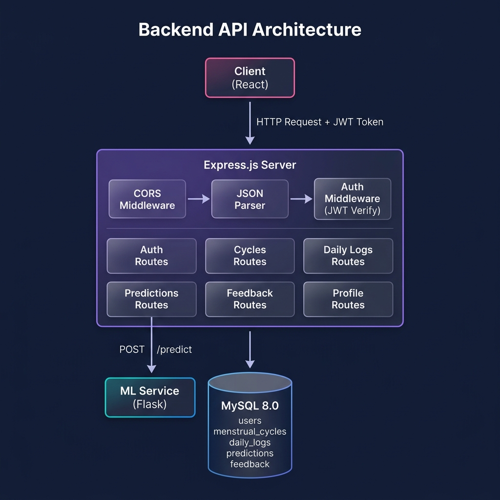
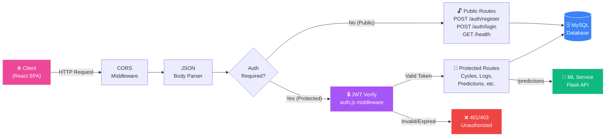
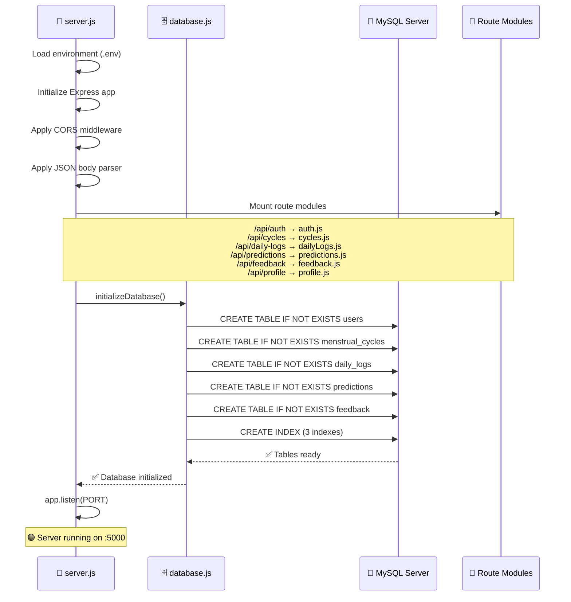
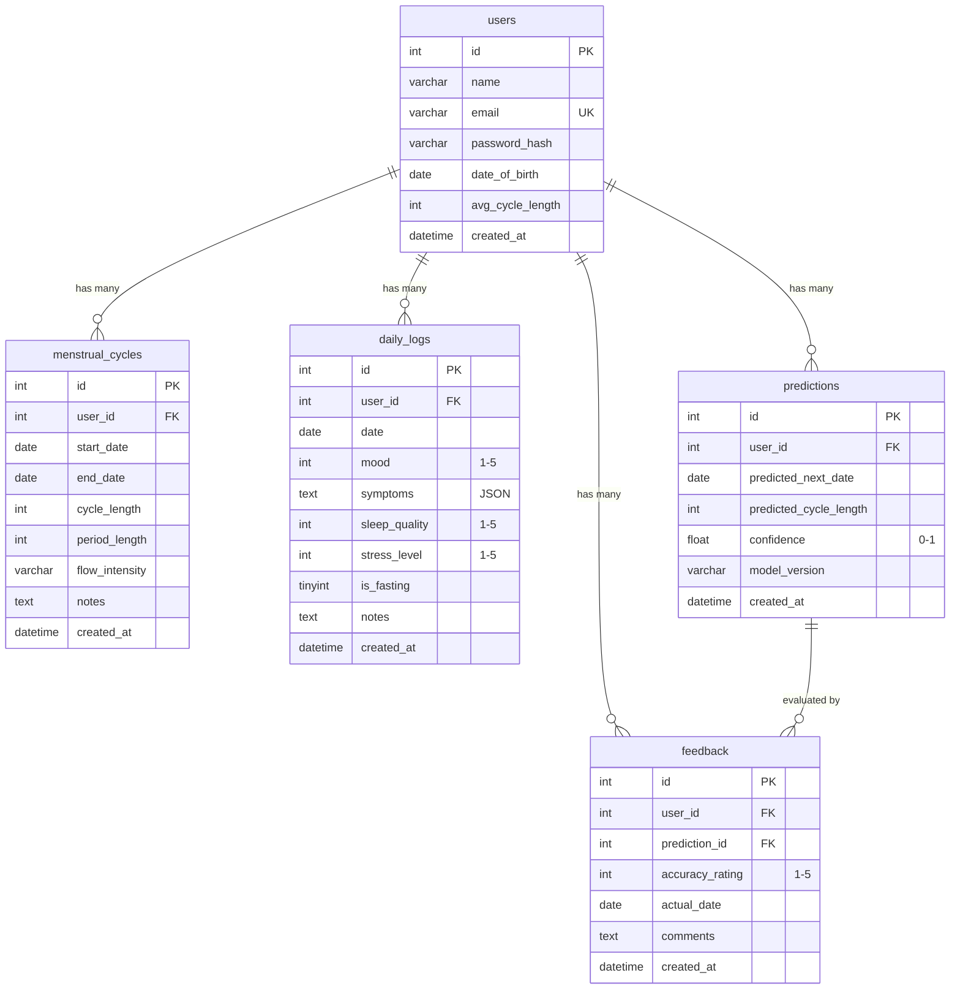
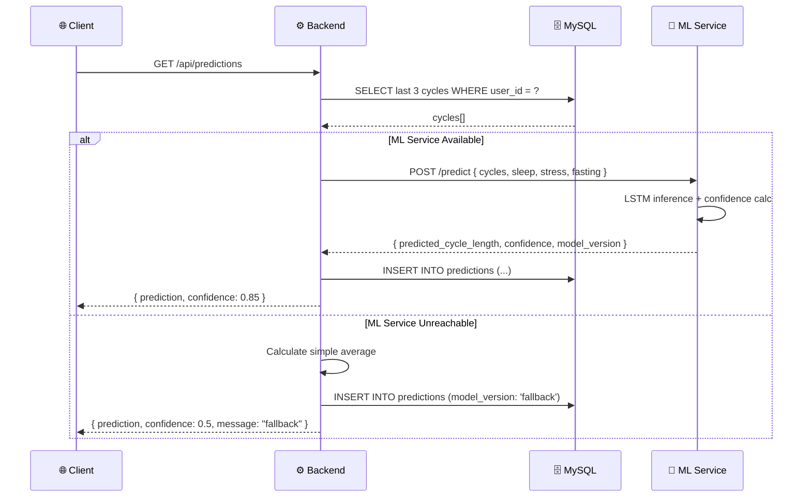

<div align="center">

# ⚙️ YeoCycles — Backend API

### Menstrual Health Companion · RESTful API Server

[](https://expressjs.com/)
[](https://www.mysql.com/)
[](https://jwt.io/)
[](LICENSE)

**REST API backend** menyediakan autentikasi JWT, CRUD operations untuk data siklus & log harian, serta integrasi dengan ML Service untuk prediksi berbasis deep learning.

[Fitur](#-fitur-utama) · [Arsitektur](#️-arsitektur) · [API Reference](#-api-reference) · [Database](#️-database-schema) · [Quick Start](#-quick-start)

</div>

---

## 🏗️ Arsitektur

### Full-Stack Overview

<p align="center">
  
</p>

### Backend API Architecture

<p align="center">
  
</p>

### Request Lifecycle — Detail

Setiap HTTP request melewati pipeline middleware berikut sebelum mencapai route handler:



### Server Startup Sequence



---

## ✨ Fitur Utama

| Fitur | Deskripsi |
|-------|-----------|
| 🔐 **JWT Authentication** | Register & login dengan token-based auth (expires 7 hari) |
| 🩸 **Cycle CRUD** | Create, Read, Update, Delete data siklus menstruasi |
| 📋 **Daily Logs** | Pencatatan mood, symptoms, tidur, stres, puasa harian |
| 🧠 **ML Integration** | Proxy ke Flask ML Service untuk prediksi siklus (LSTM) |
| 📊 **Predictions History** | Menyimpan & mengambil riwayat prediksi |
| 💬 **Feedback System** | User feedback untuk akurasi prediksi model |
| 👤 **Profile Management** | CRUD profil pengguna |
| 🛡️ **Security** | bcrypt hashing, parameterized queries, CORS |
| 🗄️ **Auto-Migration** | Tabel database dibuat otomatis saat pertama start |
| ❤️ **Health Check** | Endpoint `/api/health` untuk monitoring |

---

## 🛠️ Tech Stack

| Technology | Version | Purpose |
|------------|---------|---------|
| **Express.js** | 4.21 | Web framework (REST API) |
| **MySQL** | 8.0+ | Relational database |
| **mysql2** | 3.x | Async MySQL driver (Promise-based) |
| **jsonwebtoken** | 9.x | Token-based authentication |
| **bcryptjs** | 2.x | Password hashing (12 salt rounds) |
| **Axios** | 1.x | HTTP client (ML Service integration) |
| **dotenv** | 16.x | Environment variable management |
| **cors** | 2.x | Cross-Origin Resource Sharing |
| **nodemon** | 3.x | Dev auto-reload |

---

## 🚀 Quick Start

```bash
# 1. Clone & install
git clone https://github.com/Coding-Camp-Capstone-Project-2026/backend.git
cd backend && npm install

# 2. Setup environment
cp .env.example .env    # Edit .env dengan credentials MySQL Anda

# 3. Create database
mysql -u root -p -e "CREATE DATABASE IF NOT EXISTS menstrual_health_companion;"

# 4. Start server
npm run dev     # Development (nodemon auto-reload)
npm start       # Production
```

> **💡**: Tabel database dibuat otomatis saat server pertama kali start.

---

## 🔧 Environment Variables

| Variable | Default | Required | Description |
|----------|---------|----------|-------------|
| `PORT` | `5000` | ❌ | Port server |
| `JWT_SECRET` | — | ✅ | Secret key untuk JWT (min 32 char) |
| `ML_SERVICE_URL` | `http://localhost:5001` | ❌ | URL ML Service |
| `DB_HOST` | `localhost` | ❌ | MySQL host |
| `DB_USER` | `root` | ❌ | MySQL username |
| `DB_PASSWORD` | _(empty)_ | ❌ | MySQL password |
| `DB_NAME` | `menstrual_health_companion` | ❌ | Database name |

> **⚠️ Security**: File `.env` sudah di `.gitignore`. **JANGAN** commit credentials!

---

## 📁 Project Structure

```
backend/
├── package.json            # Dependencies & scripts
├── .env.example            # Environment template (safe)
├── .env                    # Credentials (GITIGNORED)
├── .gitignore              # Ignore rules
├── schema.sql              # Database schema (reference)
├── docs/
│   └── images/             # Architecture visuals
└── src/
    ├── server.js           # 🚀 Express entry point
    ├── db/
    │   └── database.js     # 🗄️ MySQL pool + auto-migration
    ├── middleware/
    │   └── auth.js         # 🔒 JWT verification
    └── routes/
        ├── auth.js         # 🔐 Register & login
        ├── profile.js      # 👤 Profile CRUD
        ├── cycles.js       # 🩸 Menstrual cycles CRUD
        ├── dailyLogs.js    # 📋 Daily logs CRUD
        ├── predictions.js  # 🧠 ML predictions proxy
        └── feedback.js     # 💬 Prediction feedback
```

---

## 🗄️ Database Schema

### Entity Relationship Diagram



### Indexes

```sql
CREATE INDEX idx_cycles_user ON menstrual_cycles(user_id);
CREATE INDEX idx_daily_logs_user_date ON daily_logs(user_id, date);
CREATE INDEX idx_predictions_user ON predictions(user_id);
```

---

## 🔌 API Reference

### Authentication (Public)

#### `POST /api/auth/register`
```json
// Request
{ "name": "Jane", "email": "jane@example.com", "password": "secret123", "date_of_birth": "1995-06-15" }

// Response (201)
{ "message": "Registration successful", "token": "eyJ...", "user": { "id": 1, "name": "Jane", "email": "jane@example.com" } }
```

#### `POST /api/auth/login`
```json
// Request
{ "email": "jane@example.com", "password": "secret123" }

// Response (200)
{ "message": "Login successful", "token": "eyJ...", "user": { "id": 1, "name": "Jane", "email": "jane@example.com" } }
```

### Protected Endpoints

> **Header wajib:** `Authorization: Bearer <token>`

#### 🩸 Cycles

| Method | Endpoint | Description |
|--------|----------|-------------|
| `POST` | `/api/cycles` | Tambah siklus |
| `GET` | `/api/cycles` | List semua siklus |
| `GET` | `/api/cycles/:id` | Detail siklus |
| `PUT` | `/api/cycles/:id` | Update siklus |
| `DELETE` | `/api/cycles/:id` | Hapus siklus |

#### 📋 Daily Logs

| Method | Endpoint | Description |
|--------|----------|-------------|
| `POST` | `/api/daily-logs` | Tambah/update log |
| `GET` | `/api/daily-logs?start_date=&end_date=` | Filter range |
| `GET` | `/api/daily-logs/:date` | Log per tanggal |
| `DELETE` | `/api/daily-logs/:id` | Hapus log |

#### 🧠 Predictions

| Method | Endpoint | Description |
|--------|----------|-------------|
| `GET` | `/api/predictions` | Generate prediksi → ML |
| `GET` | `/api/predictions/history` | 20 prediksi terakhir |

### Prediction Flow (ML Integration)



#### 💬 Feedback · 👤 Profile · ❤️ Health

| Method | Endpoint | Description |
|--------|----------|-------------|
| `POST` | `/api/feedback` | Submit feedback |
| `GET` | `/api/feedback` | List feedback |
| `GET` | `/api/profile` | Lihat profil |
| `PUT` | `/api/profile` | Update profil |
| `GET` | `/api/health` | Server status (no auth) |

---

## 🔒 Authentication Flow

```mermaid
sequenceDiagram
    participant U as 👤 User
    participant FE as 🖥️ React Frontend
    participant BE as ⚙️ Express Backend
    participant DB as 🗄️ MySQL

    rect rgb(30, 30, 60)
        Note over U,DB: Registration Flow
        U->>FE: Fill register form
        FE->>BE: POST /api/auth/register
        BE->>BE: Validate input
        BE->>BE: bcrypt.hash(password, 12)
        BE->>DB: INSERT INTO users
        DB-->>BE: user.id
        BE->>BE: jwt.sign({ id, email }, secret, { expiresIn: '7d' })
        BE-->>FE: { token, user }
        FE->>FE: localStorage.setItem('token')
    end

    rect rgb(30, 40, 60)
        Note over U,DB: Authenticated Request Flow
        U->>FE: Navigate to Dashboard
        FE->>FE: Attach "Authorization: Bearer <token>"
        FE->>BE: GET /api/cycles
        BE->>BE: auth.js: jwt.verify(token, secret)
        BE->>BE: req.user = { id, email }
        BE->>DB: SELECT * FROM menstrual_cycles WHERE user_id = ?
        DB-->>BE: cycles[]
        BE-->>FE: { cycles: [...] }
    end

    rect rgb(60, 30, 30)
        Note over U,DB: Token Expiry Flow
        FE->>BE: GET /api/cycles (expired token)
        BE->>BE: jwt.verify → TokenExpiredError
        BE-->>FE: 401 Unauthorized
        FE->>FE: AuthContext.logout()
        FE->>FE: localStorage.removeItem('token')
        FE-->>U: Redirect to /login
    end
```



### Security Measures

| Measure | Implementation |
|---------|---------------|
| **Password Hashing** | bcryptjs, 12 salt rounds |
| **JWT Expiry** | 7 days (`expiresIn: '7d'`) |
| **SQL Injection** | Parameterized queries (mysql2) |
| **CORS** | Configurable allowed origins |
| **Error Handling** | Consistent JSON, no stack traces |
| **Environment Vars** | `.env` gitignored |

---

## ⚠️ Error Handling

```json
{ "error": "Human-readable error message" }
```

| Status | Description | Example |
|--------|-------------|---------|
| `400` | Bad Request | Missing fields |
| `401` | Unauthorized | Invalid token |
| `403` | Forbidden | Expired token |
| `404` | Not Found | ID not found |
| `409` | Conflict | Duplicate email |
| `500` | Server Error | DB connection fail |

---

## 🔗 Related Repositories

| Repository | Description | Link |
|------------|-------------|------|
| **Frontend** | React SPA + Premium UI | [frontend](https://github.com/Coding-Camp-Capstone-Project-2026/frontend) |
| **Backend** | Express REST API (this repo) | [backend](https://github.com/Coding-Camp-Capstone-Project-2026/backend) |
| **Machine Learning** | Flask + LSTM Service | [machinelearning](https://github.com/Coding-Camp-Capstone-Project-2026/machinelearning) |

---

## 👥 Tim Pengembang

Dibuat oleh **Ridho dan teman-teman** — Capstone Project Coding Camp 2026

**Powered by [kamidukung.biz.id](https://kamidukung.biz.id/)**

